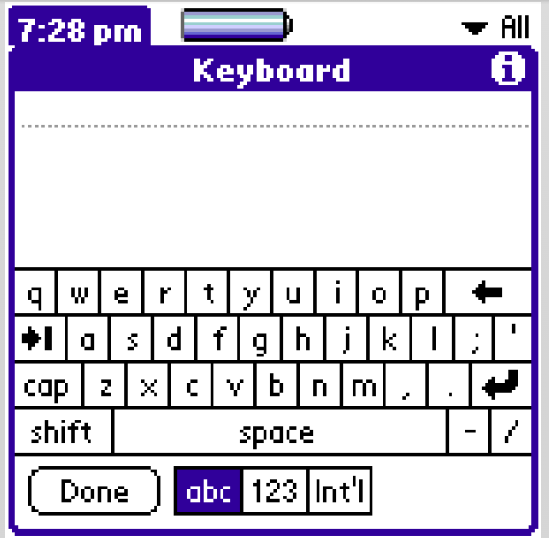
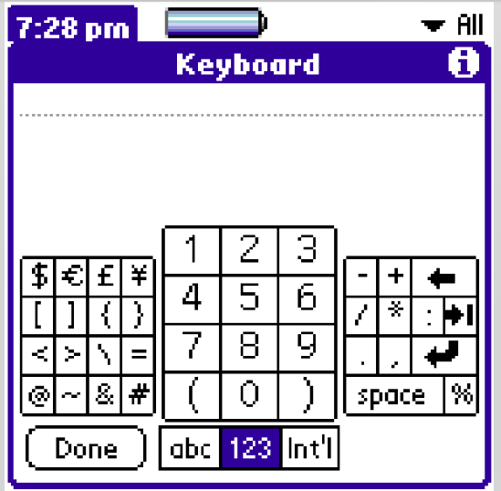

# Keyboard Resource
Defined in UI/Src/Keyboard.c

Number of keyboards is fixed. In OS4.0, three keyboards are defined: Alpha, Punc/Number, and Int'l.



Each keyboard can have multiple layouts. Typical Alpha keyboard has one layout, Punc/Number has three layouts.



```
// These two structures also exist in MakeKbd.c.
// This is the format of the data in the keyboard resource.
typedef UInt16 Offset;          // offset from the start of the resource

typedef struct {
        char            shiftedKey;             // key to use if shift is on
        char            capsKey;                        // key to use if caps lock is on
        char            unshiftedKey;
        UInt8           width;                  // the width of the key.  The text is drawn centered.
        Offset  labelOffset;    // if there is a label display it instead
                                                                        // of a key (all modes)
} KeyboardKey;

typedef struct {
        RectangleType   bounds;
        UInt8 rowHeight;
        FontID font;
        Offset keys;
        UInt8 keysPerRow[keyboardRows];
        UInt8 shiftKey;                 // can be kbdNoKey
        UInt8 capsKey;                          // can be kbdNoKey
        Boolean lastLayoutInKeyboard;
        UInt8 reserved;
} KeyboardLayout;
```
